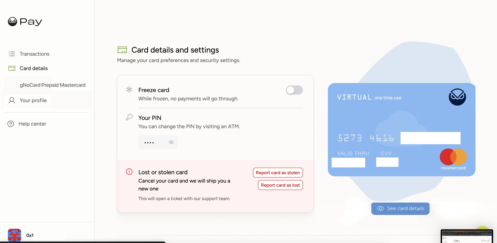
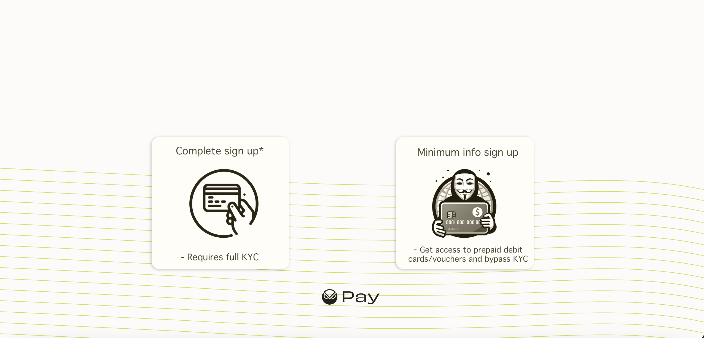
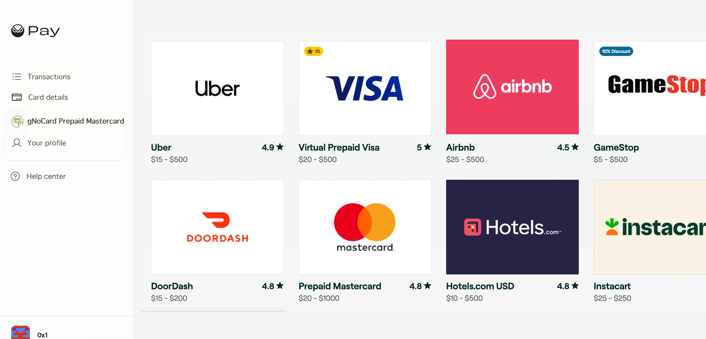
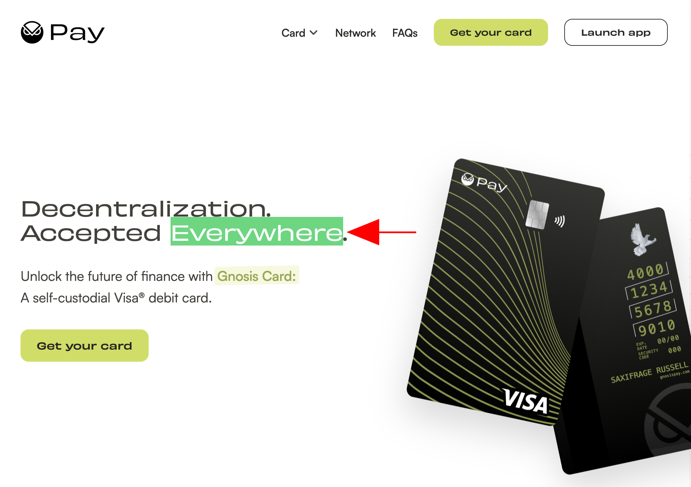
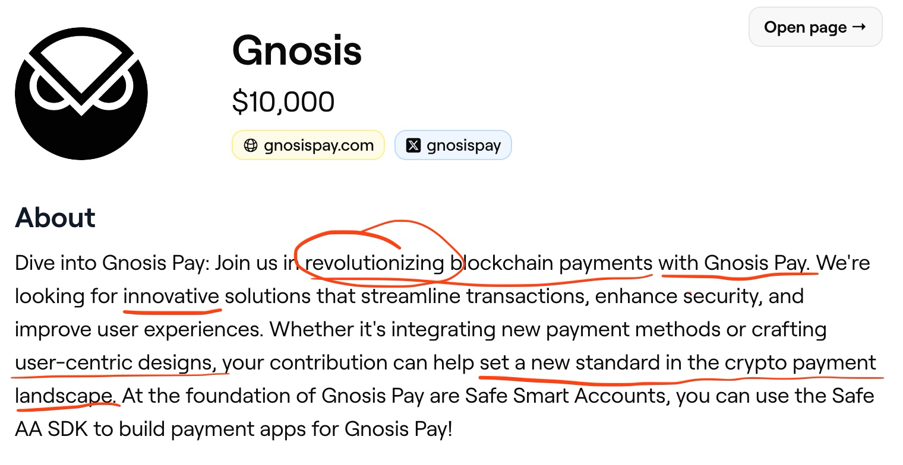
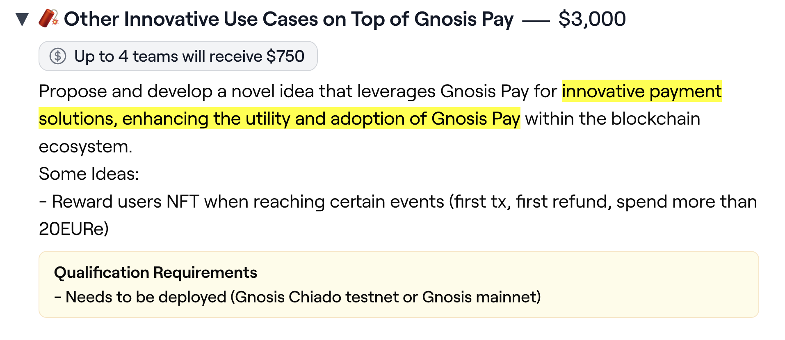
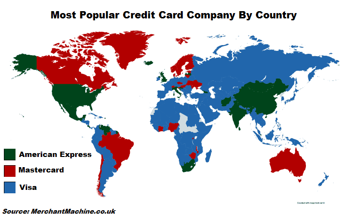

<!-- START doctoc generated TOC please keep comment here to allow auto update -->
<!-- DON'T EDIT THIS SECTION, INSTEAD RE-RUN doctoc TO UPDATE -->
**Table of Contents**  *generated with [DocToc](https://github.com/thlorenz/doctoc)*

- [gNo Card](#gno-card)
  - [Project Description](#project-description)
    - [Project Description: Proposed Design](#project-description-proposed-design)
    - [Project Description: High Level System Architecture Diagram](#project-description-high-level-system-architecture-diagram)
  - [Why gNoCard](#why-gnocard)
    - [Why gNoCard: Remembering The Core Principles](#why-gnocard-remembering-the-core-principles)
    - [Why gNoCard: Interpreting the Challenge](#why-gnocard-interpreting-the-challenge)
    - [Why gNoCard: The Wider Context](#why-gnocard-the-wider-context)
    - [Why gNoCard: Why Integrating Vouchers And Prepaid Debit Cards](#why-gnocard-why-integrating-vouchers-and-prepaid-debit-cards)

<!-- END doctoc generated TOC please keep comment here to allow auto update -->

# gNo Card

This hereby project, **gNo Card**, is meant to act an _extension_ to the existing _card-plus-account_ **Gnosis** system. With the use of _gNo Card_ ( where the letter **G** is a silent letter, therefore _NoCard_ ), the user will be able to buy goods and services in places where the **GnosisPay VISA** card doesn't work.

The _gNoCard_ system will allow the user that already has a **Safe** to still use his / her crypto monies / stable-coin monies to pay for things ( like groceries, travel, luxuries, and so on ) in places where non-crypto systems are in place and the user's VISA doesn't work or in cases where the there is a problem with the card itself. This will be achieved trough workarounds like vouchers, coupons, prepaid-cards, cross-wishlist purchases and so on. Everything will happen seamlessly with basically one click.

One can think of **gNoCard** like an _off-ramp_ to fiat / to something fiat-like where all the friction is removed.

This has the potential to also add ability to purchases goods and services where with **TRUE PRIVACY**.

---

## Project Description

Below is a high level description of ONE of the mechanisms by we will add an off-ramp fiat system:

1. User goes to the [gnosispay.com](https://gnosispay.com/);

2. The on-boarding platform shows two options: A). the legacy full-KYC option ( _Complete SignUp_ ); B). the minimum-user verification option ( _MinimumInfo SignUp_ );

3. User selects option B;

4. User gives the minimum information about himself / herself like email address;

5. User checks his / her _Safe_ account address like **`0xa1ce ...`**;

6. User tops up his / her account with EURe, GBPe, USDC etc;

7. User goes to the shop in a country where **VISA** is **NOT** accepted ( see below );

8. User after getting prompted with a message selects a way to pay for groceries with the use of a Voucher with just one tap ( this implies that the user is using the GnosisPay dashboard trough the Browser / there is a native GnosisPay app ).

9. END.

---

### Project Description: Proposed Design

Modified GnosisPay Dashboard:



See the new option: **gNoCard Prepaid Mastercard**

New on-boarding protocol:



The new gNoCard portal (where the user can buy pre-paid debit cards or vouchers or others)



---

### Project Description: High Level System Architecture Diagram

```
┌──────────────────────────────────┐        ┌───────────────────────────┐        ┌───────────────────────────┐
│                                  │ ─────► │                           │ ─────► │                           │
│ L1 / L2 Safe Account + Module(s) │        │ NoCard Middleware         │        │ Third Party Voucher API   │
│                                  │ ◄───── │                           │ ◄───── │                           │
│                                  │        │                           │        └───────────────────────────┘
│                                  │        │                           │
│                                  │        │                           │        ┌───────────────────────────┐
│                                  │        │                           │ ─────► │                           │
│                                  │        │                           │        │ Other fiat off-ramps      │
│                                  │        │                           │ ◄───── │                           │
└──────────────────────────────────┘        └───────────────────────────┘        └───────────────────────────┘
```

---

## Why gNoCard

### Why gNoCard: Remembering The Core Principles

It is our believe that Gnosis is being view by the public as a company that sticks to the **CORE PRINCIPLES** of open blockchains: 1). **open**; 2). **public**, 3). **borderless**, 4). **neutral**, and 5). **censorship-resistant**.

Keeping only **VISA** as the only go-to option for users seems more or less like a politically-motivated decision which is the third and forth pillars of crypto ( **borderless** and **neutral** ).

Not adding other types of cards other than VISA will hinder mass-adoption and hinder the brand but the brand reputation can be improved with **nGoCard**.

This goes against the slogan ( it could be seen inconsistent at best and miss-leading at worst )!

**`Decentralization. Accepted Everywhere.`**



---

### Why gNoCard: Interpreting the Challenge

We believe that this is the only way to truly revolutionize the payment card. In addition adding all workarounds in one place is ( the ability to seamlessly buy virtual / physical prepaid debit cards, the ability acquire coupons, perform cross-wishlist purchases as in fulfill the Amazon wishlist of another un-banked users and vice-versa, streamline the off-ramp to physical crypto, etc ) all those elements TOGETHER are truly **innovative**.





---

### Why gNoCard: The Wider Context

In order to achieve a wider adoption we believe it is important to also serve other users that are less fortunate and are not served by the current western-oriented bank system.

According to different sources that show-up in the top results in Google and other search engines, the payment network **Visa**, is widely accepted around the world, **however** there are countries where it is not be accepted due to various _restrictions_ or _sanctions_. As of a few now, countries where users might have huge difficulties using their Visa cards may include:

* Afghanistan

* Belarus

* Burundi

* Central African Republic (CAR)

* Chad

* Congo and The Democratic Republic of the Congo (DRC)

* Cuba

* Eritrea

* Iran

* Iraq

* Libya

* Myanmar

* North Korea

* Russia

* Somalia

* Sudan and South Sudan

* Syria

* Venezuela

* Yemen

Please note that this information could be slightly out-of-date.



Source: **[merchantmachine.co.uk/visa-mastercard-amex/](https://merchantmachine.co.uk/visa-mastercard-amex/)**

Source number 2: **[wise.com/gb/blog/using-visa-card-abroad](https://wise.com/gb/blog/using-visa-card-abroad#where-are-visa-debit-cards-not-accepted)**

---

### Why gNoCard: Why Integrating Vouchers And Prepaid Debit Cards

TBD

---
